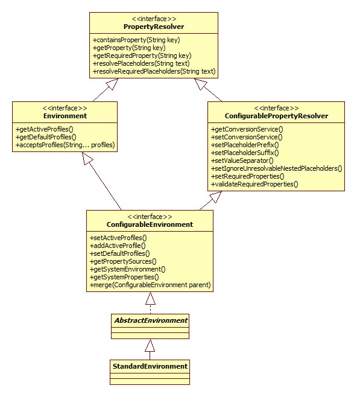

# Environment

## 基本接口认识

### PropertyResolver

用于对任意基础源进行解析其属性的接口。

### Environment

代表着当前正在运行的应用所处的环境。为应用程序环境的两个关键点建模：`profile`和`properties`。

与属性访问有关的方法是通过父接口`PropertyResolver`暴露的。

#### Profile

一个`profile`是一个命名的逻辑组，其包含一系列`bean`定义，这些`bean`定义只有当给定的`profile`是激活状态时才会被注册。`bean`可以通过`xml`或注解方式分配给`profile`。

#### Properties

属性几乎在所有的应用中都扮演一个重要的角色，并且可以来源于多种源：属性文件、JVM 系统属性、系统环境变量、JDNI、Servelt上下文参数等等。

**环境对象与属性的关系在于为用户提供一个方便的服务接口，用来配置属性源并从中解析属性。**

*属性解析，属性源本身的设置——取决于当前环境。*

### ConfigurablePropertyResolver

提供用于访问和定制`ConverionService`接口的能力，该接口用于将属性值从一种类型转换为另一种类型。

### ConfigurableEnvironment

大多数`Environment`类都将实现该配置接口，其提供用于设置激活和默认的`profile`、以及控制基础属性源的能力。允许客户端通过`ConfigurablePropertyResolver`接口设置和验证所需要的属性、自定义`Conversion Service`等。

## 关于 PropertySources

`Environment`构造器，即`AbstractEnvironment`，内部维护了一个`MutablePropertySources`对象用来保存属性源。而`MutablePropertySources`本身通过一个`CopyOnWriteArrayList`作为存储载体存储`PropertySource`。

[PropertySources](./PropertySources.md)

