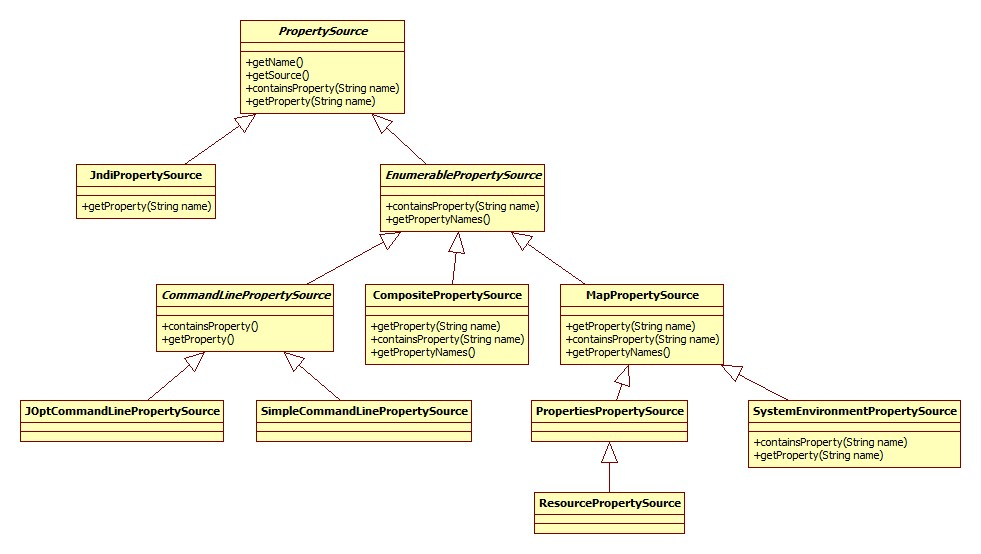

# PropertySource 接口

## 基础接口认识
### PropertySource
表示名称/值属性对的抽象类。底层源对象可以是任一封装属性的类型。如`Properties`对象、`Map`对象、`ServletContext`和`ServletConfig`对象。

通常`PropertySource`对象不是单独使用的，而是通过一个`PropertySources`对象，其聚合了属性源、以及与`PropertyResolver`的实现类集合。

对于`PropertySource`的辨别不是所封装的属性内容，而是仅仅通过`PropertySource`的名称来辨别。这对于在集合上下文中国
### JndiPropertySource

### EnumerablePropertySource
一个`PropertySource`实现，可以查询其基础源对象以枚举所有可能的属性名称/值对。暴露出`getPropertyNames`方法，允许调用者内省可用属性而无需访问基础源对象。这也有助于更有效地实现`containsProperty`，因为它可以调用`getPropertyNames`并遍历返回地数组，而不是尝试调用可能更昂贵的`PropertySource.getProperty`。